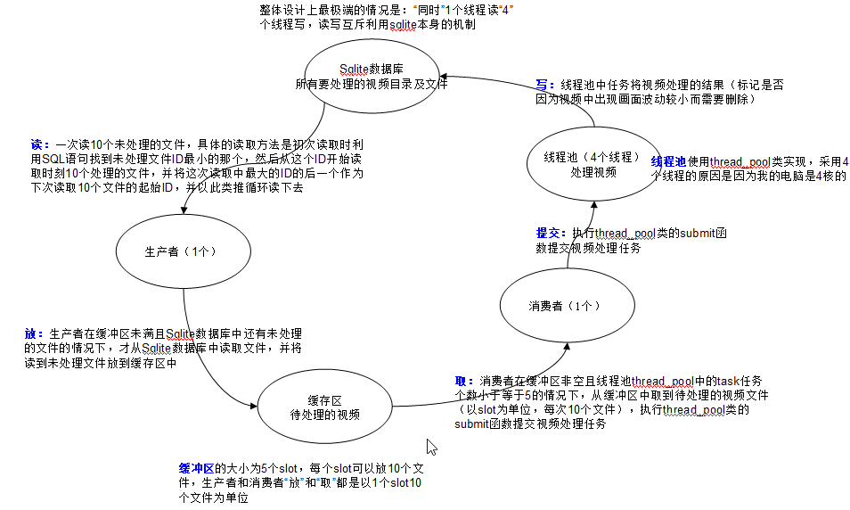

## 主要功能：

家里有3个360的摄像头，不间断地进行录像，每隔一个星期左右将录制得到的视频文件（1min长度一个视频文件）拷贝到个人电脑上，实际上家里大部分白天时间都是没有人的，很多视频文件录到的都是“静止“的画面，这种视频是没有保存价值的，本程序的主要功能就是将画面变化不大的视频删除。

怎么定义“画面变化不大”，简单来说，就是从1min视频中每隔N帧取1帧和之前取到的帧去按照一定的算法比对，根据一定的算法判断这个视频是需要删除还是保留。

当前代码中采用的算法是：

检测从视频提取出来的一系列帧，相邻之间的帧经过帧间差的计算-》二值化-》腐蚀（去噪）之后，查找看看有没有轮廓面积大于300的，如果有超过3个这样的轮廓则认为，这段时间内的视频有较大的变化，并返回true，否则返回false。此函数里面的300等值来自于FrameDetectResultSaveVideo中调测的经验值

## 程序架构图

## 文件结构：

rapidxml(xml文件读写开源代码：原本想用xml文件记录视频文件的处理结果，后来改用sqlite3数据库了)

|---license.txt

|---manual.html	

|---rapidxml.hpp

|---rapidxml_iterators.hpp

|---rapidxml_print.hpp

|---rapidxml_utils.hpp

.gitignore

BenchmarkOpencv.cpp(用来测试opencv性能，整个程序的耗时大部分都在视频文件的帧提取上了)

BenchmarkOpencv.h(，代码中尝试了两种提取视频帧的方式，并给出具体的测试数据，具体参考代码注释)

BenchmarkSqlite3.hpp(测试Sqlite3单进程、多进程、串行模式下的读写速率)

Database.cpp(用来存储视频处理结果的数据库表结构等相关代码)

Database.h

FolderUtil.cpp(包含文件遍历、文件删除等所有文件操作的工具集类)

FolderUtil.h

FrameDetect.cpp(判断视频是保留还是删除的核心算法类集合，后续可以基于此进行检测算法的扩展)

FrameDetect.h

ReadWriteThread.cpp(多线程读、1线程写的模型，当前sqlite3数据库的访问方式采用的是串行模型，没有用到这部分代码)

ReadWriteThread.h

SingleConsumerSingleProducer.hpp(单生产者单消费者模型，生产者从数据库中获取未处理视频，消费者提交给threadPool进行视频处理)

Timer.hpp(定时器相关函数C++11实现)

VideoUtil.cpp(视频处理操作工具集)

VideoUtil.h

codeConvert.cpp(GBK和UTF-8互转代码 C++11实现)

codeConvert.h

homeCameraExtractionMain.cpp(主程序循环，实现的功能就是homeCameraExtractionOpencv3架构图)

homeCameraExtractionMain.h

homeCameraExtractionOpencv3架构图.ppt

main.cpp(用来进行测试和进行homeCameraExtractionMain运行的)

myLogger.hpp(日志系统代码)

myLoggerTest.cpp(日志系统测试代码)

netClient.cpp(网络通讯客户端代码)

netClient.h

netServer.cpp(网络通讯服务器端代码)

netServer.h

test.cpp(为提升代码质量，每写一段代码都进行了自行的测试，此文件是测试代码的合集)

test.h

testProcess.cpp(测试创建进程的相关代码，主要用于监控程序发现主程序故障了之后，自动拉起主程序)

test_for_cpp.db(未使用)

thread_pool.hpp(线程池，C++11实现)

## 涉及到的知识点：

### 文件遍历

使用C语言自带的direct.h库中的函数进行文件遍历和文件删除操作

### Sqlite3数据库

难点在于windows系统默认的中文编码是GBK，sqlite默认存储的编码格式是UTF-8，这里涉及到较多的中文编码格式转换操作，具体参考业务代码

### C++11多线程

相关代码主要参考《C++ Concurrency in Action》这本书中的代码

### GBK和UTF-8编码

**关键知识点：**内存中保存的都是Unicode，两个字节，只有在存储到文件或者在网络传输的时候才采用GBK或者UTF-8

### 多进程通讯（socket）：select模型

**关键知识点：**//设置接收超时，注意这个设置一定要在bind和accept等操作之前，且此参数设置仅适用于阻塞模式
	setsockopt(serverSocket, SOL_SOCKET, SO_RCVTIMEO, (char *)&nNetTimeout, sizeof(int));

### opencv3图像处理

主要参考《学习opencv3》这本书中的代码

### 日志系统

当前尚未使用，具体使用方法可以参考测试代码

### 其他：

此程序代码利用晚上下班之后的时间，断断续续写了大概小半年，过程中查找的资料都记录到如下路径了，详细内容可以参考：https://github.com/msjobzhou/gitskills 中的readme.md文件

